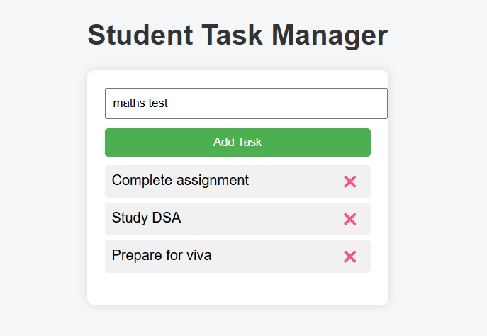

  

# Student Task Manager

This is a simple web-based Student Task Manager application built using HTML, CSS, and JavaScript.

## Features
- Add daily tasks
- Delete tasks
- Tasks are saved using browser localStorage
- Simple and clean user interface

## Technologies Used
- HTML
- CSS
- JavaScript

## How to Run
1. Download the repository
2. Extract the ZIP file
3. Open index.html in any web browser

## Project Repository
Winter-Project-2024

